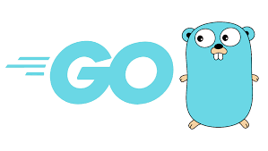

<div align="center" id="top"> 
  

  &#xa0;

  <!-- <a href="https://tutorial.netlify.app">Demo</a> -->
</div>

<h1 align="center">LearnGo</h1>

<p align="center">
  

  

  

  

  <!--  -->

  <!--  -->

  <!--  -->
</p>

<!-- Status -->

<!-- <h4 align="center"> 
	🚧  Tutorial 🚀 Under construction...  🚧
</h4> 

<hr> -->

<p align="center">
  <a href="#dart-about">About</a> &#xa0; | &#xa0; 
  <a href="#rocket-technologies">Technologies</a> &#xa0; | &#xa0;
  <a href="#checkered_flag-starting">Starting</a> &#xa0; | &#xa0;
  <a href="https://github.com/YaswanthGadde007/" target="_blank">Author</a>
</p>

<br>

## :dart: About ##

This repo contains all of my early go code when I first started learning. I'll continue to include all of the go code and topics that I've come across while learning the language.


## :rocket: Technologies ##

The following tools were used in this project:

- [Go](https://go.dev/)

## :checkered_flag: Starting ##

```bash
# Clone this project
$ git clone https://github.com/YaswanthGadde007/LearnGo


```

&#xa0;

<a href="#top">Back to top</a>
